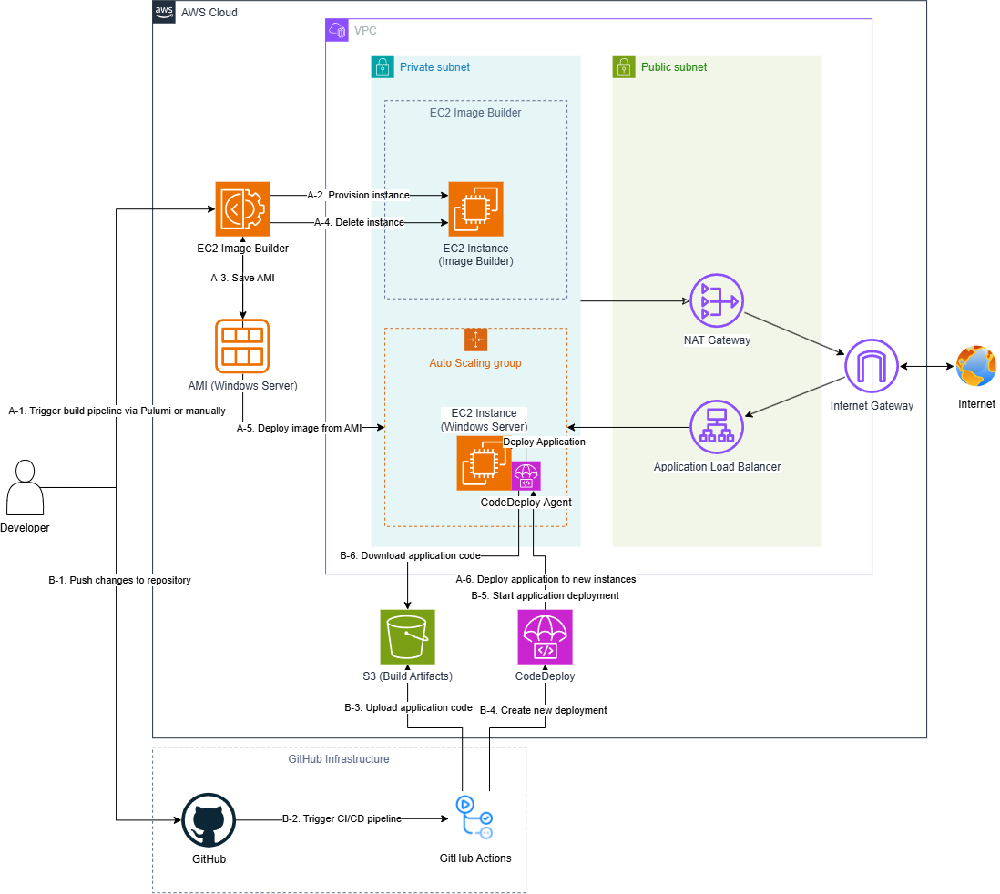
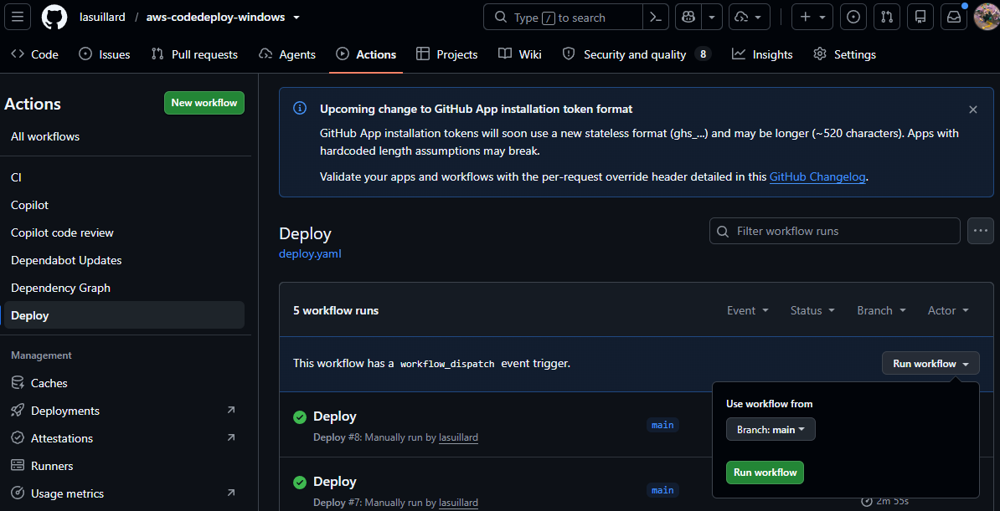
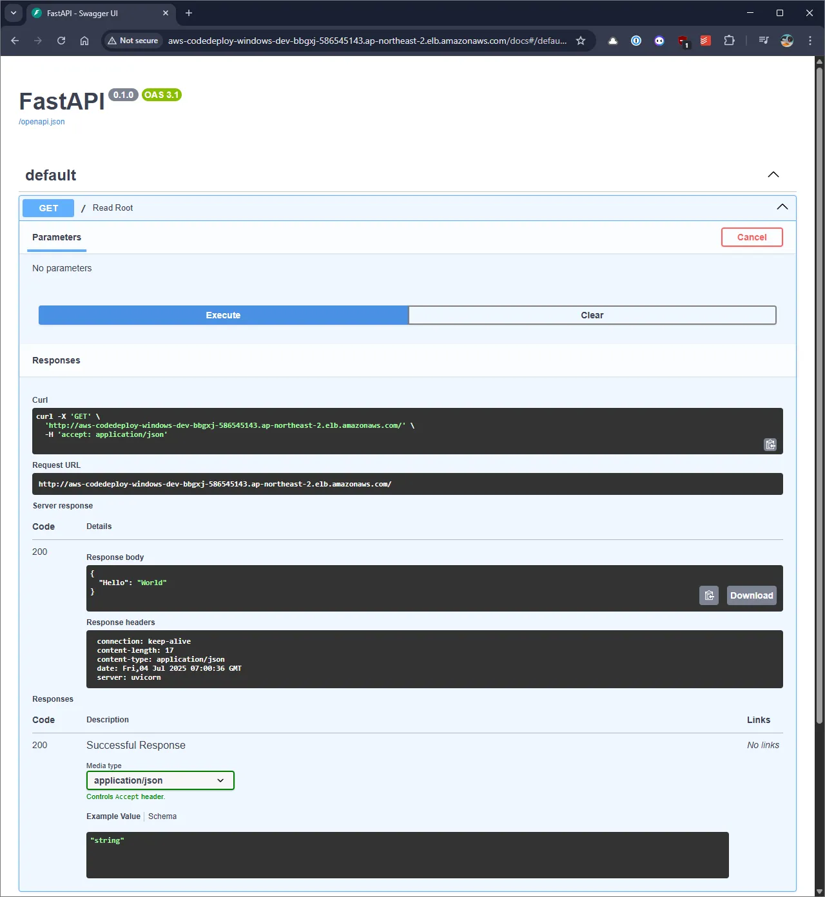

# aws-codedeploy-windows

Example deploying a Python application to AWS Windows EC2 instances with CodeDeploy.

## 👀 Overview

This project demonstrates building and deploying a Python application to AWS Windows EC2 instances using CodeDeploy, including the creation of custom AMI images and the setup of the necessary infrastructure. Primary objectives to achieve include:

- **Windows-based web application**: Develop and deploy a Python web application specifically designed to run on Windows EC2 instances.
- **Custom AMI creation**: Delegate heavy lifting of setting up the Windows environment and dependencies to pre-built AMI images, ensuring faster and more consistent instance launches.
- **Automated deployment**: Enable seamless and repeatable deployment of the Python application to Windows EC2 instances using AWS CodeDeploy.
- **Infrastructure as Code**: Manage and provision AWS resources consistently and efficiently using Pulumi.

## 🏗️ Architecture



### 🗂️ Key directories

- `assets/`: Assets used in the project. Primarily virtual keyboard images.
- `deploy/aws-codedeploy/`: Deployment scripts and configurations for AWS CodeDeploy.
- `infrastructure/`: Infrastructure as Code (IaC) for provisioning AWS resources. Uses Pulumi.
  - `components`: Reusable Pulumi components to reduce code duplication and simplify infrastructure management.
  - `dynamic`: Pulumi dynamic providers for custom resource management.
  - `imagebuilder-components/`: EC2 Image Builder components for building custom AMI images.
- `lab/windows-server/`: Local lab environment for Windows Server. Uses Vagrant and libvirt.
- `scripts/`: Utility scripts for various tasks such as deployment and initialization of the application.
- `src/`: Source code for the demo scraping application.
- `test/`: Test cases for the application.

## ⚙️ Technical details

- Pulumi IaC

    To manage overall infrastructure and resources on AWS, Pulumi IaC is used. It is also possible to use other IaC tools, but Pulumi provides a unified approach using a single programming language with support for dynamic providers, making it easier to handle complex resource management scenarios.

- Windows Server

    In this project, Windows Server is required to handle specific application requirements (website-specific security programs) that cannot be fulfilled by other operating systems.

- EC2 Image Builder

    EC2 Image Builder is used to create custom AMI images for Windows EC2 instances. This allows for pre-configuring the instances with necessary software and settings, ensuring consistency and reducing setup time during deployment.

- CodeDeploy

    AWS CodeDeploy is used to automate the deployment of the application to Windows EC2 instances. It ensures that the application is consistently deployed across all instances and helps manage updates and rollbacks efficiently, with seamless integration with other AWS services such as Auto Scaling.

- Other (VPC, IAM, S3, ALB, etc.)

    Foundational AWS services that support the overall infrastructure and application deployment, including networking, security, storage, and load balancing. It is not the primary focus of this project but is essential for the proper functioning of the other components.

## 💻 Getting started

This project is provisioned using Pulumi IaC and deployed via AWS CodeDeploy through GitHub Actions.

### 🛠️ Prerequisites

This repository uses [Nix Flakes](https://nix.dev/concepts/flakes.html) to manage tools. The following tools will be automatically installed (you must have `nix` installed):

- `pre-commit`
- `uv`
- `pulumi`
- `awscli2` (`aws`)
- `ssm-session-manager-plugin` (`session-manager-plugin`)
- etc. (see [flake.nix](flake.nix))

Run `nix develop` to activate the environment. This will automatically install the above tools. Alternatively, you can use the included Dev Container configuration which has Nix installed. However, it is recommended to work on the host machine in case a local VM is needed during development, as it provides better performance and access to system resources.

### 🚀 Provisioning infrastructure

To provision the infrastructure using Pulumi, follow the steps below (AWS and GitHub CLI should be configured in advance):

```bash
$ cd infrastructure

# Initialize Pulumi project and dev stack, **locally**
$ pulumi login --local
$ pulumi stack init dev
$ pulumi config set github-repository-fullname <your-github-username>/<your-repository-name>

# Provision infrastructure
$ pulumi up
```

Once the Pulumi commands have been successfully executed, the infrastructure will be provisioned. Initial AMI build will be triggered as part of the infrastructure provisioning process. In addition, the necessary GitHub repository configuration including environment and repository variables and secrets will be set up.

Wait for AMI build to complete before proceeding with application deployment. Then, trigger the deployment workflow from GitHub Actions:

> [!NOTE]
> The deployment workflow is configured to run only on the manual trigger, because this project is not intended to be deployed automatically on every push.



Once deployed, you can access the application in a browser using the ALB (Application Load Balancer) public DNS name (e.g. `http://aws-codedeploy-windows-dev-buqpf-710038041.ap-northeast-2.elb.amazonaws.com/docs`).



## 🧹 Cleanup

Most of the resources created by Pulumi will be removed when running the below commands:

```bash
$ pulumi destroy
$ pulumi stack rm dev
```

However, resources such as Image Builder images, AMIs, and EBS Snapshots are created externally. We use a [Dynamic Provider](https://www.pulumi.com/docs/iac/concepts/providers/dynamic-providers/) to delete them automatically. However, there might be cases where manual cleanup is still required. So it is recommended to check if any of these resources still exist and delete them manually if necessary.
