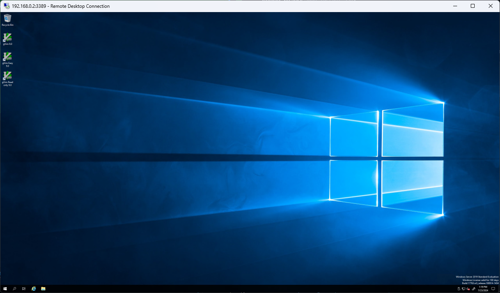

# 🪟 Windows Server

Virtual machine configuration to provision remote webdrivers (Selenium Grid) on Windows OS.

## 📃 Requirements

Following tools are required to provision the VM (require root privileges):

- [Vagrant](https://developer.hashicorp.com/vagrant)
- [Libvirt](https://ubuntu.com/server/docs/libvirt)
- [vagrant-libvirt](https://github.com/vagrant-libvirt/vagrant-libvirt) plugin

## 📦 Provision VM

Follow these steps to provision the VM:

1. Download the [base box](https://app.vagrantup.com/jborean93/boxes/WindowsServer2022): `vagrant box add jborean93/WindowsServer2022 --provider libvirt`
1. Run `sudo vagrant up` to provision and start the VM.
1. Wait for the VM to be fully provisioned, then check the instance via SSH using `sudo vagrant ssh`. Default username and password are `vagrant`.
1. Find the VM IP address using `sudo vagrant ssh-config`.
1. Check if Selenium Node is running properly: `curl http://<vm_ip>:5555/status`.

## 🪡 Access to the VM

Vagrant has built-in port forwarding capability. You can use `vagrant rdp` or `vagrant ssh` to access the VM.

To access to the VM from other machines is required, use `socat` as a simple and straightforward alternative.

You can use the `port-forward.sh` helper script to forward the RDP port (3389) to the host machine. Run the following command in a terminal:

```bash
$ ./port-forward.sh 3389 3389
```

Then, you can connect to the VM using your preferred RDP client with the IP of the host machine and port 3389.


